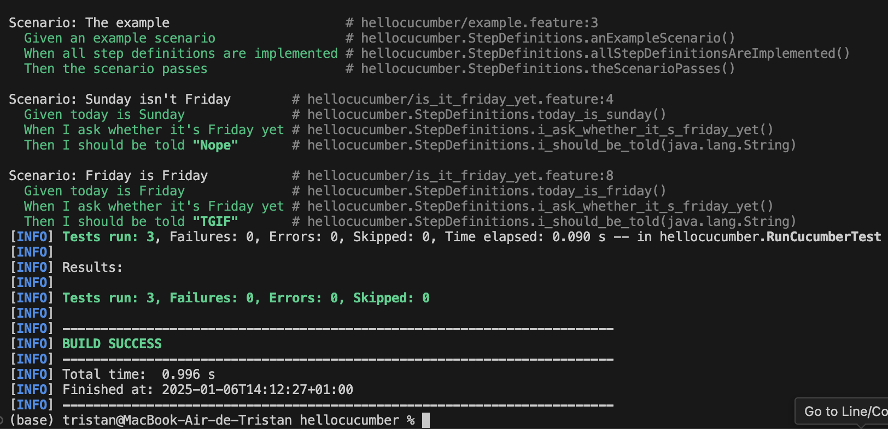
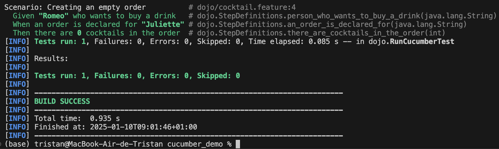

= R5.A.08 -- Dépôt pour les TPs
:icons: font
:MoSCoW: https://fr.wikipedia.org/wiki/M%C3%A9thode_MoSCoW[MoSCoW]

Ce dépôt concerne les rendus de mailto:tristan.delthil@etu.univ-tlse2.fr[Tristan Delthil].

== TP1
Fichier "is_it_friday_yet.feature" : 

Feature: Is it Friday yet? +
  Everybody wants to know when it's Friday

  Scenario: Sunday isn't Friday
    Given today is Sunday
    When I ask whether it's Friday yet
    Then I should be told "Nope"
  Scenario: Friday is Friday
    Given today is Friday
    When I ask whether it's Friday yet
    Then I should be told "TGIF"

Code :
[source,java]
private String today;
private String actualAnswer;

[source,java]
@Given("today is Sunday")
public void today_is_sunday() {
    today = "Sunday";
}

[source,java]
@Given("today is Friday")
public void today_is_friday() {
    today = "Friday";
}

[source,java]
@When("I ask whether it's Friday yet")
public void i_ask_whether_it_s_friday_yet() {
    actualAnswer = IsItFriday.isItFriday(today);
}

[source,java]
@Then("I should be told {string}")
public void i_should_be_told(String expectedAnswer) {
    assertEquals(expectedAnswer, actualAnswer);
}
---

.Capture d'écran des tests

== TP2...
Fichier Order.java : 

[source,java]
package dojo;
import java.util.ArrayList;
import java.util.List;

[source,java]
public class Order {
    private String owner;
    private String target;
    private List<String> cocktails;

[source,java]
    public Order() {
        this.cocktails = new ArrayList<>();
    }
    public void declareOwner(String owner) {
        this.owner = owner;
    }
    public void declareTarget(String target) {
        this.target = target;
    }
    public List<String> getCocktails() {
        return cocktails;
    }
    public void addCocktail(String cocktail) {
        cocktails.add(cocktail);
    }
}

